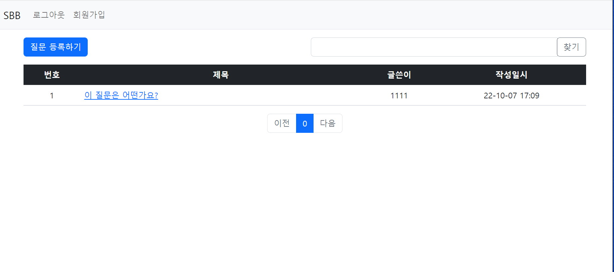
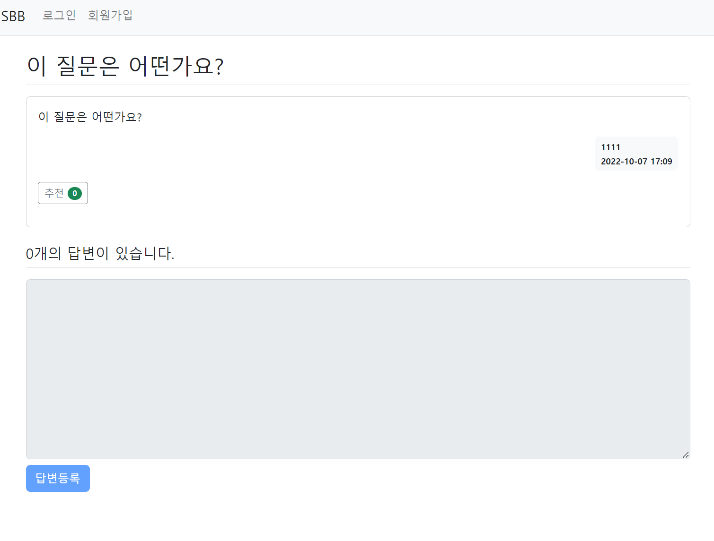
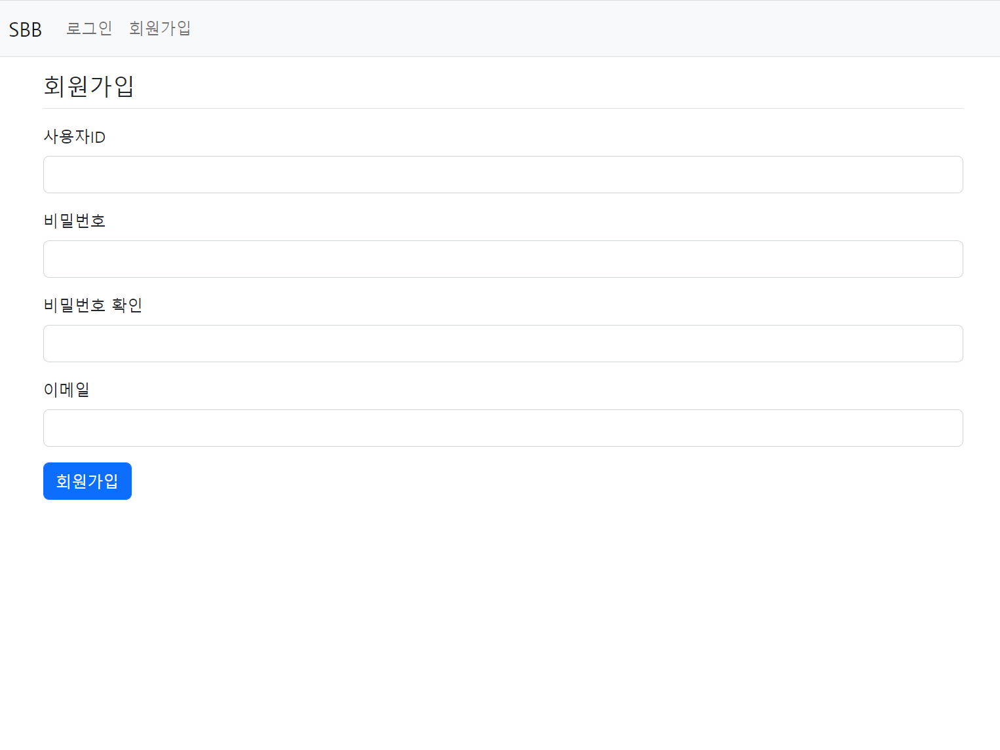
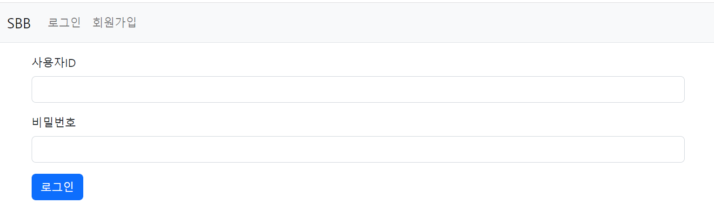

<div id="top"></div>
<!--
*** Thanks for checking out the Best-README-Template. If you have a suggestion
*** that would make this better, please fork the repo and create a pull request
*** or simply open an issue with the tag "enhancement".
*** Don't forget to give the project a star!
*** Thanks again! Now go create something AMAZING! :D
-->

<!-- PROJECT SHIELDS -->
<!--
*** I'm using markdown "reference style" links for readability.
*** Reference links are enclosed in brackets [ ] instead of parentheses ( ).
*** See the bottom of this document for the declaration of the reference variables
*** for contributors-url, forks-url, etc. This is an optional, concise syntax you may use.
*** https://www.markdownguide.org/basic-syntax/#reference-style-links
-->


<!-- PROJECT LOGO -->
<br />
<div align="center">
  <a href="https://github.com/kimdonghyeon3/SpringBoot_bashboard">
    
  </a>

<h3 align="center">스프링부트 게시판 구현</h3>

  <p align="center">
    web의 기본 프로젝트 / 완벽 게시판
    <br />
    <a href="https://github.com/kimdonghyeon3/SpringBoot_bashboard"><strong>View Demo »</strong></a>
    <br />
    <br />

  </p>
</div>


<!-- ABOUT THE PROJECT -->
## About The Project



Spring boot를 연습해보면서, 기본적인 게판의 CRUD를 익혀보며, 더 나아가 JPA/Paging/Security/Mysql/Search을 활용해 보면서 실제 운영하는 사이트의 구조를 이해하고
재현해 본 프로젝트이다.
<br/><br/>
**새로운 도전을 하기 전에 기존의 기본적인 페이지를 이해해야 한다. 이러한 사고를 통해서 본 프로젝트를 진행해 보게 되었다.**

<p align="right">(<a href="#top">back to top</a>)</p>

### Built With
    
    
<p align="right">(<a href="#top">back to top</a>)</p>

<!-- GETTING STARTED -->
## Getting Started

### 설치 방법

1. Clone the repo
   ```sh
   git clone https://github.com/kimdonghyeon3/SpringBoot_bashboard.git
   ```

2. JDK Setting
   ```sh
   projectstructure -> project -> sdk
   setting -> gradle 검색 -> gradle JVM
   ```
   
3. Run Start
   ```sh
   start
    ```
   
<p align="right">(<a href="#top">back to top</a>)</p>

<!-- USAGE EXAMPLES -->
## Usage

회원가입을 통해 회원을 생성 후 원하는 질문을 등록하면된다. 

<p align="right">(<a href="#top">back to top</a>)</p>

<!-- DEMO EXAMPLES -->
## Demo





<p align="right">(<a href="#top">back to top</a>)</p>

<!-- CONTACT -->
## Contact

Email - kimdonghyeon98@gmail.com

Project Link: [https://github.com/kimdonghyeon3/SpringBoot_bashboard](https://github.com/kimdonghyeon3/SpringBoot_bashboard)

<p align="right">(<a href="#top">back to top</a>)</p>

MIT License
Copyright (c) 2021 Othneil Drew

<!-- MARKDOWN LINKS & IMAGES -->
<!-- https://www.markdownguide.org/basic-syntax/#reference-style-links -->
[contributors-shield]: https://img.shields.io/github/contributors/github_username/repo_name.svg?style=for-the-badge
[contributors-url]: https://github.com/github_username/repo_name/graphs/contributors
[forks-shield]: https://img.shields.io/github/forks/github_username/repo_name.svg?style=for-the-badge
[forks-url]: https://github.com/github_username/repo_name/network/members
[stars-shield]: https://img.shields.io/github/stars/github_username/repo_name.svg?style=for-the-badge
[stars-url]: https://github.com/github_username/repo_name/stargazers
[issues-shield]: https://img.shields.io/github/issues/github_username/repo_name.svg?style=for-the-badge
[issues-url]: https://github.com/github_username/repo_name/issues
[license-shield]: https://img.shields.io/github/license/github_username/repo_name.svg?style=for-the-badge
[license-url]: https://github.com/github_username/repo_name/blob/master/LICENSE.txt
[linkedin-shield]: https://img.shields.io/badge/-LinkedIn-black.svg?style=for-the-badge&logo=linkedin&colorB=555
[linkedin-url]: https://linkedin.com/in/linkedin_username
[product-screenshot]: images/screenshot.png
